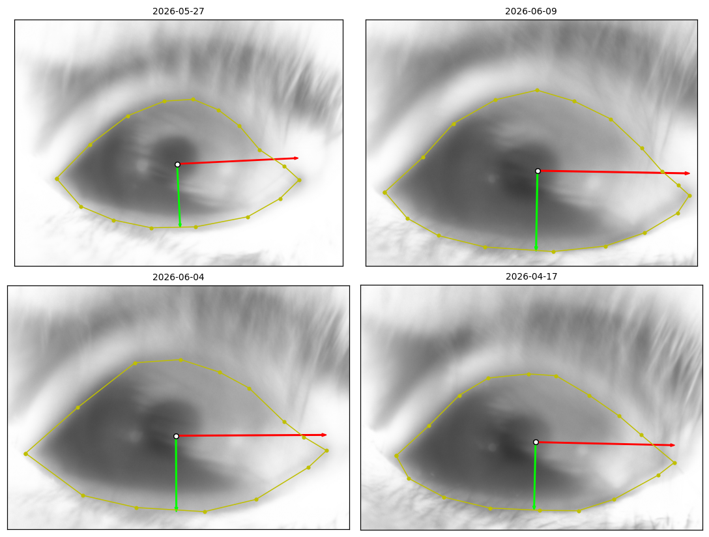
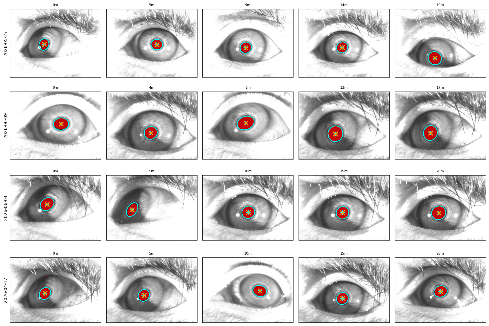
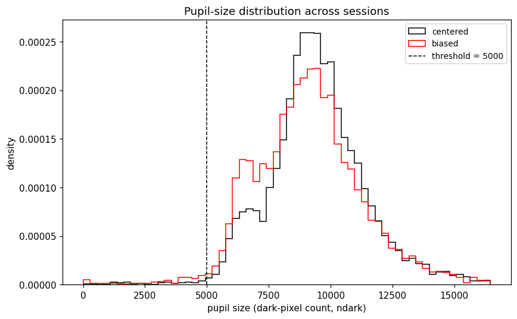
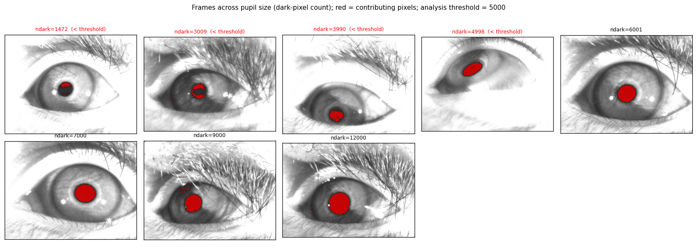
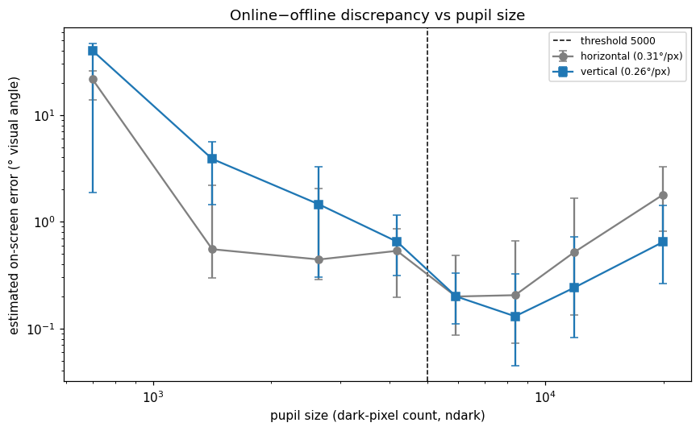
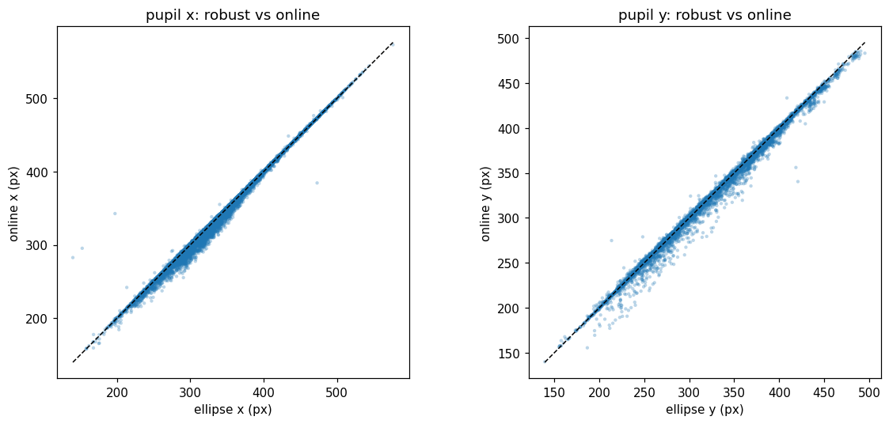
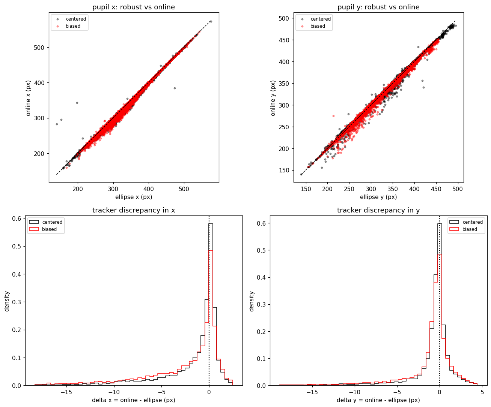

# Across-session pupil position — results (N = 1000)

Generated by `make_report.py` from `results.json`. Animal `AT-B1NO1`.

## Question

Days labeled "biased" (from the online gaze estimate) show gaze offset to one side; "centered" days do not. Test whether this reflects a real difference in pupil position or an artifact of the online pupil tracker.

## Method

- 14 sessions, 7 per condition. 1000 frames per session, equally spaced across the recording, decoded with ffmpeg; frames with no detected pupil (blinks) are dropped.
- Two pupil-center estimates per frame: **robust ellipse** (`detect_pupil_ellipse`: dark-threshold → morphology → largest circular contour → ellipse center) and **online** (`get_pupil_online`: centroid of pixels in intensity band (0, 50] after a 3×3 erosion — the acquisition pipeline). The online dark-pixel count `ndark` is the pupil-size proxy.
- **Eye-anchored frame** (`eye_frame`): per session, landmarks clicked around the eye opening define a PCA frame — `u` horizontal (along the fissure), `v` vertical, normalized so ±1 = the landmark extent, 0 = center; invariant to image crop, translation, zoom.

---

# Part A — qualitative inspection and pupil-size threshold

## Eye-based coordinate frame

Four example sessions: mean eye, clicked landmarks (yellow), and axes from the origin (white dot) — `u` red, `v` green, each to `+1` at the tip.



## Tracking quality — example frames per session

Rows = sessions, columns = example frames. Red = pixels contributing to the online centroid; robust ellipse (cyan outline + `+`); online centroid (orange `×`). On open-eye frames the contributing pixels are the pupil and the two estimates coincide.



## Pupil size and threshold

Pooled pupil-size (`ndark`) distribution across sessions, per condition (step, density):



Both conditions peak near ~9000; only ~1% of detected frames fall below the 5000 threshold. Example frames across `ndark` show why: below ~5000 the pupil is small/partly occluded; above it the pupil is clearly open.



Online-vs-offline discrepancy converted to on-screen error (degrees visual angle) vs pupil size confirms the threshold: the error bottoms out at ~0.13–0.2° for `ndark` ≈ 5000–10000 and rises steeply below ~5000 (occlusion) and, more mildly, above ~14000 (excess dark material). Points = median per bin; error bars = 25–75th percentile; horizontal (gray, 0.31°/px), vertical (blue, 0.26°/px).



**Threshold: `ndark > 5000`.** All analyses below use only frames above it (this removes ~0.7% of centered and ~1.6% of biased *detected* frames; the distribution is bimodal, so the threshold mainly formalizes exclusion of near-closed frames).

---

# Part B — analysis (frames with `ndark > 5000`)

## Offline vs online agreement

Robust ellipse vs online centroid, pooled over all sessions (open frames):

- correlation: `x` r = 0.997, `y` r = 0.997
- median |online − offline|: `x` = 0.87 px, `y` = 0.67 px; per-session r = 0.98–1.00.



**On-screen impact.** At 1 m viewing, screen ≈ 70°×40°, with gaze spanning ~85% width / full height, the pupil sweeps ~192 px horizontally and ~155 px vertically → gain ≈ **0.31°per pupil-px (horizontal)**, **0.26°per pupil-px (vertical)**. So the measured ~0.7–1 px online–offline disagreement is ≈ **0.2–0.3°of visual angle**; a hypothetical 5-px error would be ≈ 1.3–1.5°. (Errors scale inversely with assumed gaze coverage.)

## Eye-frame position — centered vs biased

Mean of the 7 per-session means, Welch t-test on those means (df ≈ 12):

| tracker | axis | centered | biased | t | p |
|---|---|---:|---:|---:|---:|
| robust | u (horizontal) | −0.068 | −0.107 | 3.05 | **0.0106** |
| robust | v (vertical) | −0.056 | −0.047 | −0.46 | 0.657 |
| online | u (horizontal) | −0.074 | −0.116 | 2.94 | **0.0132** |
| online | v (vertical) | −0.061 | −0.055 | −0.32 | 0.757 |

Biased days sit ~0.04 more negative in `u`, consistent across both trackers; horizontal only (Cohen's d ≈ 1.6). Using all detected frames (no threshold) gives the same result (robust u p = 0.012, online u p = 0.014). Tracker rows are not independent (r = 0.99).

Histograms: black = centered, red = biased; dotted line = eye center. Horizontal panels (left) shift between conditions; vertical panels (right) overlap.


## Tracker discrepancy by condition

Per-session median (online − offline) on open frames: Δx and Δy are a few pixels in both conditions and do not track the ~0.04 eye-frame difference above.



## Signal is in the eye frame, not raw image position

Per-session mean pupil `x` (open frames):

| measure | biased − centered | Welch p |
|---|---:|---:|
| raw image x / frame-width | −0.010 | 0.512 |
| eye-frame `u` (robust) | −0.039 | 0.0106 |

The between-condition difference appears in the pupil position referenced to the eye, not in raw normalized image x (which is confounded by per-session crop/resolution).

## Per-session eye-frame position (mean over open frames)

`rob` = robust, `onl` = online.

| condition | date | u_rob | v_rob | u_onl | v_onl | n |
|---|---|---:|---:|---:|---:|---:|
| centered | 2026-05-27 | −0.047 | −0.032 | −0.046 | −0.037 | 970 |
| centered | 2026-04-30 | −0.098 | −0.060 | −0.100 | −0.066 | 959 |
| centered | 2026-06-11 | −0.079 | −0.127 | −0.082 | −0.130 | 949 |
| centered | 2026-06-09 | −0.068 | +0.012 | −0.072 | +0.012 | 961 |
| centered | 2026-03-02 | −0.089 | −0.090 | −0.103 | −0.091 | 634 |
| centered | 2026-02-04 | −0.053 | −0.059 | −0.064 | −0.078 | 957 |
| centered | 2026-02-13 | −0.044 | −0.035 | −0.048 | −0.040 | 972 |
| biased | 2026-06-04 | −0.083 | −0.068 | −0.090 | −0.077 | 964 |
| biased | 2026-05-20 | −0.117 | −0.069 | −0.117 | −0.076 | 940 |
| biased | 2026-05-12 | −0.070 | −0.081 | −0.072 | −0.087 | 973 |
| biased | 2026-04-17 | −0.146 | −0.027 | −0.157 | −0.039 | 935 |
| biased | 2026-03-19 | −0.100 | −0.015 | −0.118 | −0.021 | 924 |
| biased | 2026-04-13 | −0.102 | −0.053 | −0.108 | −0.058 | 977 |
| biased | 2026-04-07 | −0.132 | −0.015 | −0.151 | −0.027 | 961 |

## Conclusion

Horizontal pupil position in eye-based coordinates is shifted on biased days relative to centered days (robust t = 3.05, p = 0.011; online t = 2.94, p = 0.013); vertical is unchanged. The shift is present in **both** the offline and online estimates (per-frame r = 0.99), and on valid frames the two disagree by only ~0.7–1 px (≈ 0.2–0.3°). The day-to-day difference therefore reflects a **real shift in horizontal pupil position within the eye**, seen regardless of tracker, not an artifact of the online pupil-detection step. Provided the gaze calibration is accurate, the estimated monitor gaze coordinates reflect this real shift.

## Limitations

- Session as unit: n = 7 per condition. The horizontal effect is significant (p = 0.011, d ≈ 1.6); the vertical null is not proof of no vertical effect at this n.
- `u`/`v` are normalized per session by that session's landmark extent — depends on landmark placement consistency (verify with `show_landmarks(date)`).
- On-screen degree estimate assumes ~85% width / full height gaze coverage; it scales inversely with the true coverage. Exact conversion needs the calibration mapping.
- Openness threshold `ndark > 5000` (the online tracker's own floor is 300).

## Reproduce

```python
import eyevideo as ev
ev.ANIMAL_DIR = "/mnt/at-storageB1_I/EyeVideo/AT-B1NO1"
ev.OPEN_MIN = 5000          # pupil-size (dark-pixel) openness floor for all comparisons
# python make_report.py     # tracks all sessions at N=1000 (cached), writes results.json + figures/
```
Landmarks: `eye_landmarks.json`. Tracking cache: `.track_cache/` (regenerated on demand).
