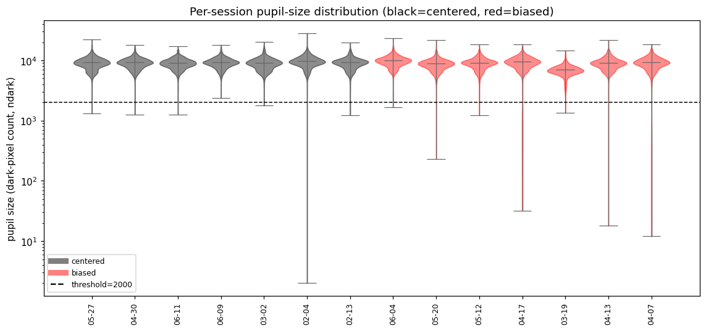
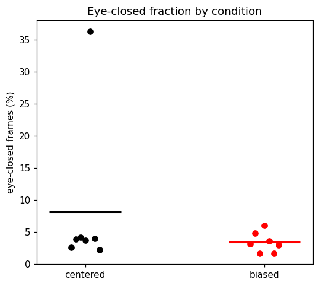

# Across-session pupil position — results (N = 1000)

Generated by `make_report.py` from `results.json`. Animal `AT-B1NO1`.

## Question

Days labeled "biased" (from the online gaze estimate) show gaze offset to one side; "centered" days do not. Test whether this reflects a real difference in pupil position or an artifact of the online pupil tracker.

## Data and method

- 14 sessions, 7 per condition. 1000 frames per session, equally spaced across the full recording, decoded with ffmpeg. Frames with no detected pupil (blinks/closures) are dropped.
- Two pupil-center estimates per frame:
  - **robust ellipse** (`detect_pupil_ellipse`): dark-threshold → morphological open/close → largest contour with circularity ≥ 0.45 → ellipse center.
  - **online** (`get_pupil_online`): centroid of pixels in intensity band (0, 50] after a 3×3 erosion — the acquisition pipeline's method. Its dark-pixel count (`ndark`) is the pupil-size proxy used throughout.
- **Eye-anchored frame** (`eye_frame`): per session, ≥5 landmarks clicked around the eye opening; PCA gives the horizontal axis `u` (along the fissure) and vertical axis `v`, normalized so ±1 = the landmark extent, 0 = center. The pupil center is projected into this frame — a measure invariant to image crop, translation, and zoom.
- **Openness filter:** all eye-frame comparisons use only frames with pupil size `ndark > 2000` (see Result 2). Per session, each axis is summarized by the **mean** over those frames; conditions are compared with a **Welch t-test on the 7 per-session means** (`_group_test`). A frame-level t-test is computed for reference only and is not used for inference (frames within a session are correlated → pseudo-replication).

## Eye-based coordinate frame

Four example sessions (two centered, two biased): mean eye image, clicked landmarks (yellow), and the eye-frame axes from the origin (white dot, `u=0`/`v=0`) — `u` horizontal (red), `v` vertical (green), each reaching `+1` at the tip.


## Result 1 — tracking quality

Example frames from four sessions (two centered, two biased): red = pixels that pass the online threshold and contribute to the centroid; robust ellipse (cyan outline + center `+`); online centroid (orange `×`). On open-eye frames the contributing pixels are the pupil and the two estimates coincide.


Offline (robust) vs online, pooled over all 14 sessions (per-frame, identical frames):

- correlation: `x` r = 0.994, `y` r = 0.992
- median |online − robust|: `x` = 0.88 px, `y` = 0.67 px; per-session correlations 0.98–1.00.

The two estimates are highly correlated; the per-frame discrepancy is usually sub-pixel to a few pixels, and the largest discrepancies occur on near-closed frames (Result 2).


## Result 2 — pupil size and eye openness

Pupil size is the online dark-pixel count `ndark`. The online tracker's own validity range is `[300, 40000]`; for the analysis we use a stricter floor of **2000** ("pupil sufficiently open").

Per-session `ndark` distributions (log scale): the bulk sits at ~9000–10000 in every session, with thin low tails toward the threshold. Very few frames fall near 2000.



Example frames across `ndark` in 500-px steps confirm the threshold: below ~2000 the pupil is barely emerging (eye half-closed); by ~2500–4000 it is clearly open. (Below 300 — not shown — is fully closed.) So 2000 is a conservative "open" floor.


Because the distribution is bimodal (open ≈ 6000–15000, or fully-closed/undetected) with almost nothing in between, **only 0.1–0.9% of *detected* frames fall below 2000**; the openness filter mainly formalizes the exclusion of the fully-closed frames that were already undetected.

Per-session eye-closed fraction (undetected + `ndark` outside `[2000, 40000]`), by condition:

- centered mean 8.1% (median 3.9%), biased mean 3.4% (median 3.1%); Welch p = 0.36.
- The centered mean is inflated by one session (2026-03-02, 36% closed); every other session is 2–6%.
- No significant difference in eye-closed fraction between conditions.



All eye-frame comparisons below use frames with `ndark > 2000`.

## Result 3 — horizontal eye-frame position differs between conditions; vertical does not

Mean of the 7 per-session means (open frames), and Welch t-test on those means (df ≈ 12):

| tracker | axis | centered | biased | t | p |
|---|---|---:|---:|---:|---:|
| robust | u (horizontal) | −0.068 | −0.107 | 3.01 | **0.0114** |
| robust | v (vertical) | −0.056 | −0.048 | −0.43 | 0.675 |
| online | u (horizontal) | −0.074 | −0.116 | 2.92 | **0.0137** |
| online | v (vertical) | −0.062 | −0.056 | −0.28 | 0.784 |

Biased days sit ~0.04 more negative in `u`, consistent across both trackers; the effect is horizontal only (Cohen's d ≈ 1.6). Using **all detected frames** (no openness filter) gives the same result (robust u p = 0.012, online u p = 0.014), so it is not driven by closed/half-closed frames. The two tracker rows are not independent (r = 0.99).

Histograms: black = centered, red = biased; dotted line = eye center (0). Horizontal panels (left) are shifted between conditions; vertical panels (right) overlap.


## Result 4 — tracker discrepancy by condition

Per-session median (online − robust) on open frames (`compare_agreement`): Δx and Δy are a few pixels in both conditions and do not track the ~0.04 eye-frame difference in Result 3. See `figures/tracker_discrepancy.png`.


## Result 5 — the signal is in the eye frame, not in raw image position

Per-session mean pupil `x` (open frames), two ways:

| measure | biased − centered | Welch p |
|---|---:|---:|
| raw image x / frame-width | −0.010 | 0.514 |
| eye-frame `u` (robust) | −0.039 | 0.0114 |

The between-condition difference appears in the pupil position referenced to the eye, not in raw normalized image x. (The raw image measure is confounded by per-session crop/resolution and is shown only for contrast.)

## Per-session eye-frame position (mean over open frames)

`u` = horizontal (−1..+1, 0 = centered), `v` = vertical. `rob` = robust, `onl` = online.

| condition | date | u_rob | v_rob | u_onl | v_onl | n |
|---|---|---:|---:|---:|---:|---:|
| centered | 2026-05-27 | −0.047 | −0.032 | −0.046 | −0.037 | 976 |
| centered | 2026-04-30 | −0.098 | −0.060 | −0.101 | −0.066 | 963 |
| centered | 2026-06-11 | −0.079 | −0.127 | −0.082 | −0.131 | 959 |
| centered | 2026-06-09 | −0.068 | +0.011 | −0.072 | +0.011 | 963 |
| centered | 2026-03-02 | −0.089 | −0.089 | −0.103 | −0.090 | 639 |
| centered | 2026-02-04 | −0.053 | −0.059 | −0.064 | −0.077 | 964 |
| centered | 2026-02-13 | −0.044 | −0.036 | −0.047 | −0.041 | 982 |
| biased | 2026-06-04 | −0.082 | −0.067 | −0.089 | −0.076 | 970 |
| biased | 2026-05-20 | −0.118 | −0.070 | −0.118 | −0.077 | 954 |
| biased | 2026-05-12 | −0.070 | −0.080 | −0.072 | −0.087 | 984 |
| biased | 2026-04-17 | −0.146 | −0.026 | −0.158 | −0.038 | 949 |
| biased | 2026-03-19 | −0.100 | −0.021 | −0.116 | −0.028 | 965 |
| biased | 2026-04-13 | −0.102 | −0.054 | −0.108 | −0.058 | 984 |
| biased | 2026-04-07 | −0.132 | −0.015 | −0.152 | −0.028 | 976 |

## Conclusion

Horizontal pupil position in eye-based coordinates is shifted on biased days relative to centered days (robust t = 3.01, p = 0.011; online t = 2.92, p = 0.014); vertical position is unchanged. The shift is present in **both** the offline (robust ellipse) and online (threshold-centroid) estimates, which are highly correlated (per-frame r = 0.99), and it is unchanged when closed/half-closed frames are excluded (Result 2) — eye-closed fraction also does not differ between conditions. The day-to-day difference therefore reflects a **real shift in horizontal pupil position within the eye**, seen regardless of which tracker is used, rather than something specific to the online pupil-detection step. Provided the gaze calibration is accurate, the estimated monitor gaze coordinates reflect this real shift.

## Limitations

- Session as unit: n = 7 per condition. The horizontal effect is significant (p = 0.011) with large effect size; the vertical null is not proof of no vertical effect at this n.
- `u`/`v` are normalized per session by that session's landmark extent, so they depend on landmark placement consistency; verify with `show_landmarks(date)`.
- Fixed online threshold (band 0–50, `high=50`); openness floor `ndark > 2000` (the online tracker's own floor is 300).
- Detection excludes closed-eye frames; 2026-03-02 has lower yield (639/1000).

## Reproduce

```python
import eyevideo as ev
ev.ANIMAL_DIR = "/mnt/at-storageB1_I/EyeVideo/AT-B1NO1"
ev.OPEN_MIN = 2000          # pupil-size (dark-pixel) openness floor for all comparisons
# python make_report.py     # tracks all sessions at N=1000 (cached), writes results.json + figures/
```
Landmarks: `eye_landmarks.json`. Tracking cache: `.track_cache/` (regenerated on demand).
