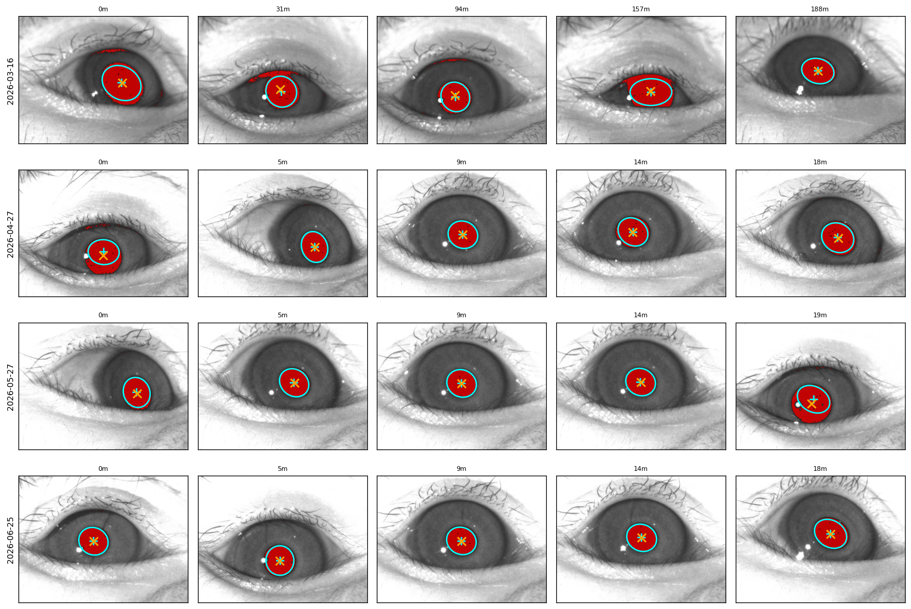
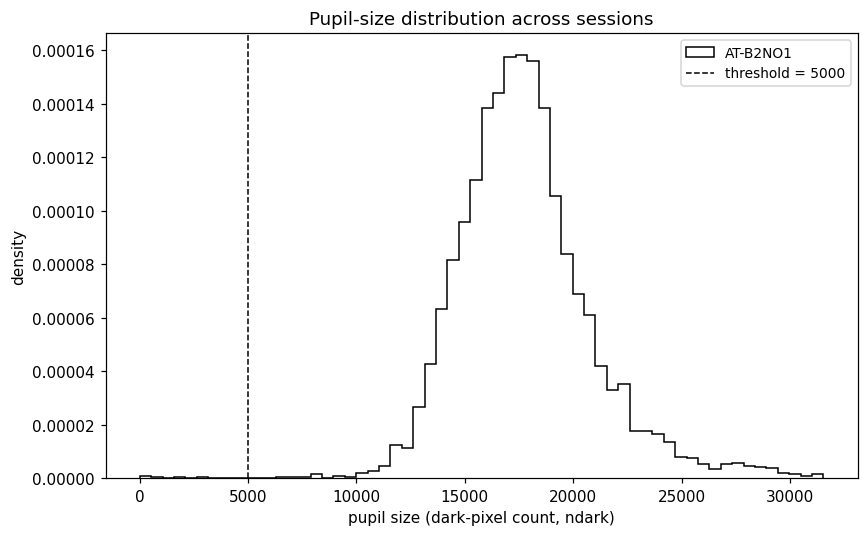
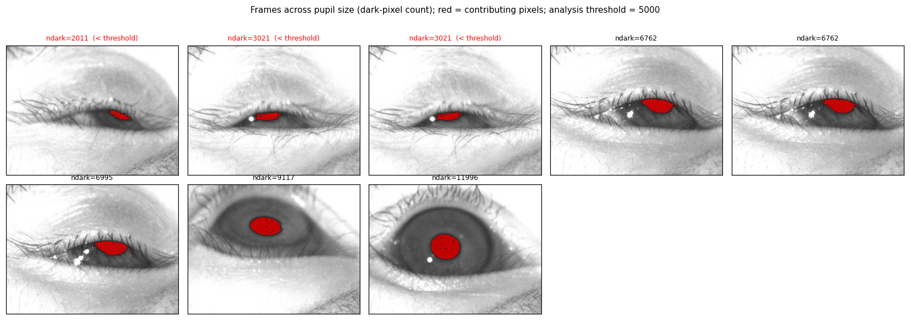
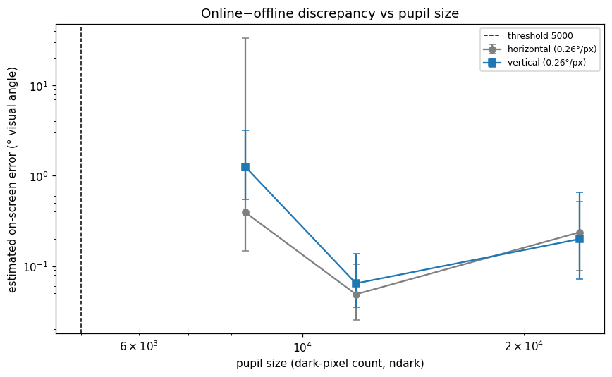
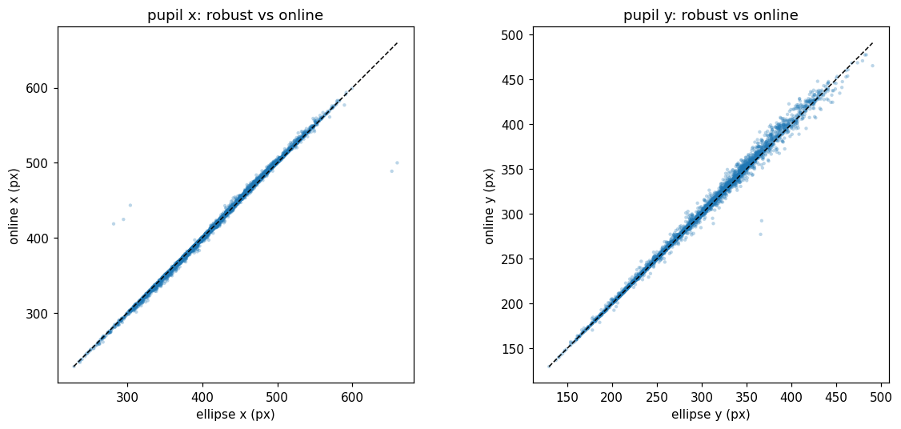
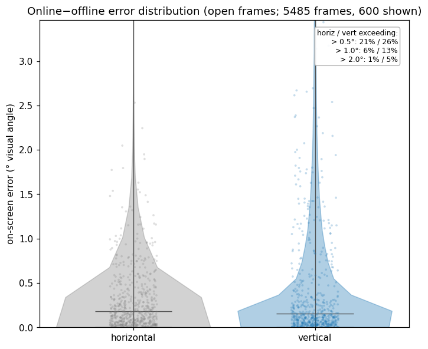
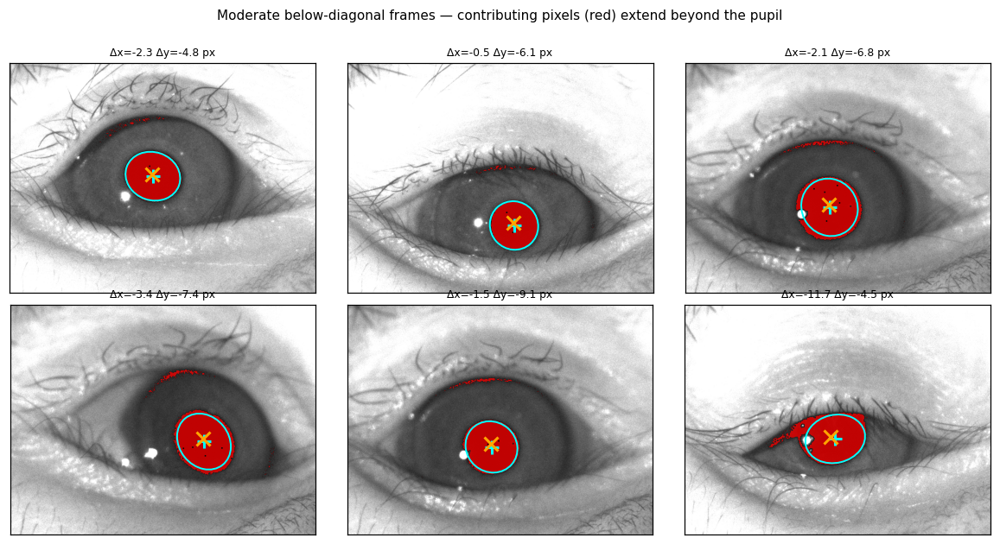

# B2 booth — tracking quality & offline-vs-online agreement (N = 1000)

Generated by `make_report_b2.py` from `results_b2.json`. Animal `AT-B2NO1`, second booth (`/mnt/at-storageB2_I`).

This replicates **Part A** (tracking quality + pupil-size threshold) and **Part B — offline vs online agreement** from the main report on a second booth. The eye-frame position analysis and the centered/biased condition comparison are **not** run here (no clicked landmarks, no condition labels).

## Sessions

7 sessions spanning the last ~4 months, 1000 frames each: `2026-03-16, 04-06, 04-27, 05-13, 05-27, 06-11, 06-25`. Same detectors and thresholds as the main report (online band (0, 50], openness `ndark > 5000`). Per-session open-frame counts: 963, 872, 812, 877, 895, 928 — **except 2026-03-16 (138)**, a low-yield/mostly-closed session (86% of frames closed); it contributes little and does not drive the pooled result.

---

# Part A — tracking quality and pupil size

## Example frames per session

Red = pixels contributing to the online centroid; robust ellipse (cyan outline + `+`); online centroid (orange `×`). The pupil is larger/darker than in B1 (`ndark` median ~17500), and detection is clean across sessions.



## Pupil size and threshold

Pooled pupil-size (`ndark`) distribution; the 5000 threshold sits well below the main mass.





Online-vs-offline error vs pupil size (degrees; gain 0.26°/px), median ± 25–75th pct — same shape as B1: low error for open pupils, rising below ~5000.



---

# Part B — offline vs online agreement (frames with `ndark > 5000`)

Robust ellipse vs online centroid, pooled over all sessions (5485 open frames):

- correlation: `x` r = **0.996**, `y` r = **0.997**
- median |online − offline|: `x` = **0.83 px**, `y` = **0.69 px**



**On-screen error distribution** (degrees, full-height gain): median **0.18°(horizontal) / 0.15°(vertical)**; tail **> 1°: 6% / 13%**, **> 2°: 1% / 5%**. Somewhat tighter than B1 (larger pupils → smaller relative error).



**Below-diagonal examples** (moderate discrepancy, both axes) — same mechanism as B1: dark pixels beyond the pupil (upper eyelid margin / iris shadow) pull the online centroid off the geometric pupil center.



## Summary

On the B2 booth the online tracker reproduces the offline (robust) pupil center just as in B1 — per-frame r ≈ 0.997, median disagreement < 1 px (≈ 0.15–0.18°), with the same small structured below-diagonal bias and a modest big-error tail. Detection is reliable on open frames; low-yield sessions (e.g. 2026-03-16) are flagged by the pupil-size / openness filter.

## Reproduce

```python
import eyevideo as ev
ev.ANIMAL_DIR = "/mnt/at-storageB2_I/EyeVideo/AT-B2NO1"
# python make_report_b2.py   # tracks 7 sessions at N=1000 (cached), writes results_b2.json + figures_b2/
```
