# Report 1 — Online vs offline eye-tracking reliability (both animals)

Generated by `make_report_accuracy.py` from `results_accuracy.json`. Booths `AT-B1NO1` (`/mnt/at-storageB1_I`) and `AT-B2NO1` (`/mnt/at-storageB2_I`).

## Question

How accurate is the **online** pupil tracker (dark-pixel centroid, used during acquisition) relative to a **robust offline** pupil detector (ellipse fit), across the two animals?

## Method

- 2 booths × 7 sessions, 1000 frames/session (equally spaced), N=1000.
- **Online** (`get_pupil_online`): centroid of pixels in intensity band (low, high] after a 3×3 erosion — the acquisition method. **Offline** (`detect_pupil_ellipse`): dark-threshold → morphology → largest circular contour → ellipse center.
- **Booth-specific thresholds** (set day-to-day by the experimenter; low = 0 always):
  - **Booth 1: high = 50**, openness `ndark > 5000` — pupils are dark (1st-pct intensity ≈ 40), so high=50 captures the pupil without sweeping in the iris.
  - **Booth 2: high = 40**, openness `ndark > 11000` — larger/darker pupils; the openness floor set from the pupil-size histogram.
- Analysis on **open frames only** (`ndark >` the booth floor). No eye-frame / condition analysis here (that is Report 2).

**Threshold sensitivity (important).** The online tracker is sensitive to `high`. On booth 1, the online-vs-offline horizontal error is 0.55 px at high=40, 0.67 px at high=50, but **15 px (≈3.9°) at high=60** — because high=60 exceeds the pupil intensity and pulls the centroid into the iris. Using an appropriate per-booth `high` is essential; a too-high value silently produces large, systematic errors.

## Result — accuracy by booth

| | Booth 1 (AT-B1NO1, high=50) | Booth 2 (AT-B2NO1, high=40) |
|---|---|---|
| open frames (>threshold) | 6402 | 5435 |
| pupil size (ndark) median | 9,372 | 16,797 |
| correlation x / y | 0.997 / 0.998 | 1.000 / 0.999 |
| median \|online − offline\| | 0.67 / 0.58 px | 0.63 / 0.56 px |
| on-screen gain (°/px) | 0.257 | 0.220 |
| on-screen error, median (h/v) | 0.17° / 0.15° | 0.14° / 0.12° |
| error > 1° (h/v) | 16% / 9% | 4% / 13% |
| error > 2° (h/v) | 7% / 4% | 0% / 4% |

On both booths, at the correct threshold, the online centroid tracks the offline pupil to **< 1 px (≈ 0.15°) median** with per-frame correlation ≈ 1.0. A minority of frames have larger error (a few % > 2°), driven by the below-diagonal effect (dark pixels beyond the pupil pulling the centroid) shown per booth below.

On-screen error uses the full-height gain (40° / vertical pupil range at 1 m viewing, 70°×40° screen).

## Booth 1 (AT-B1NO1, high=50, open>5000)

Example frames (red = online contributing pixels; cyan ellipse + center; orange online ×):

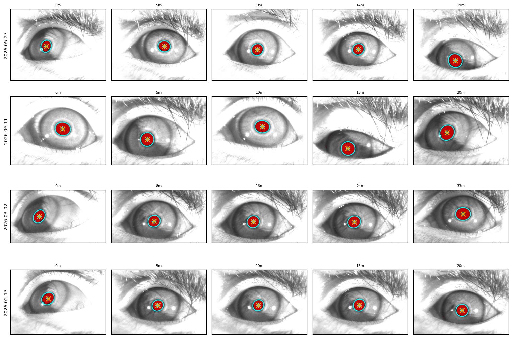

Pupil-size distribution and threshold:

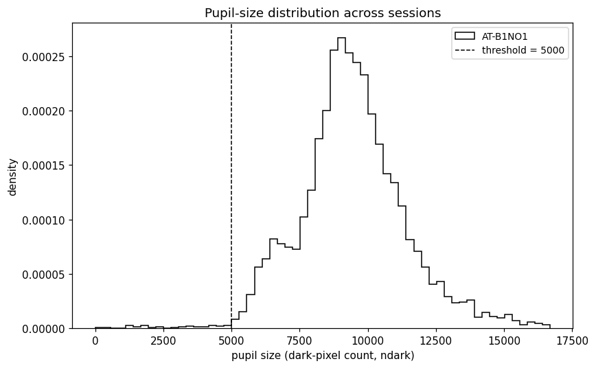
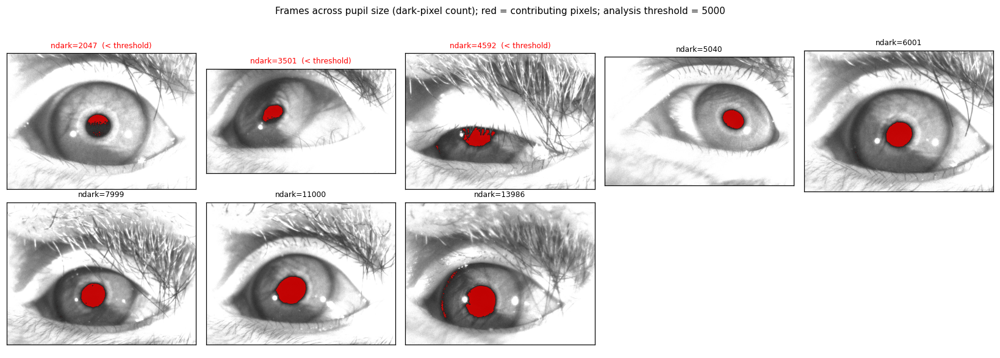
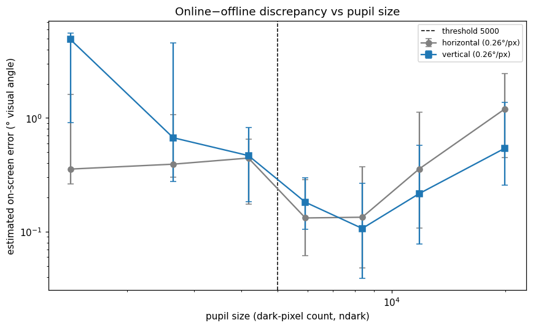

Offline vs online agreement (open frames), moderate below-diagonal examples, and on-screen error distribution:

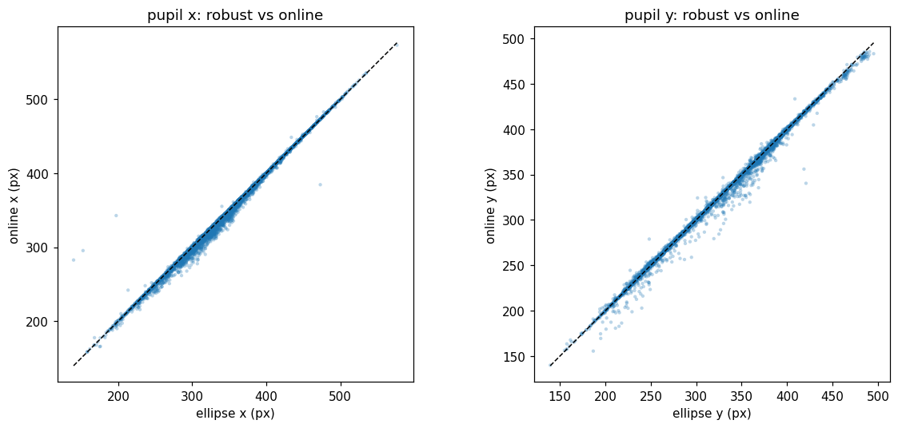
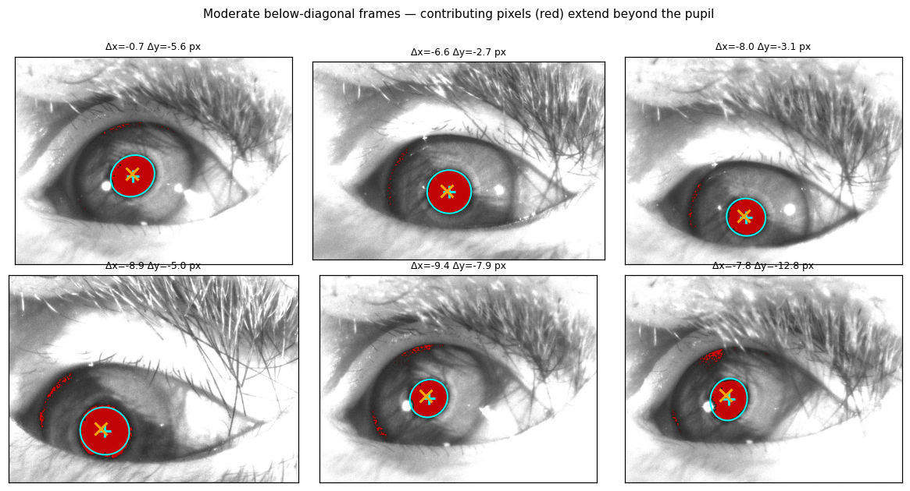
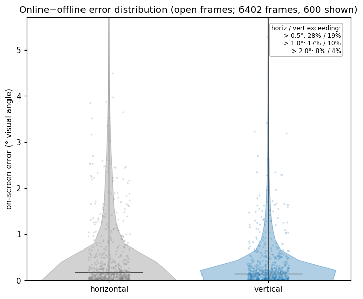

## Booth 2 (AT-B2NO1, high=40, open>11000)

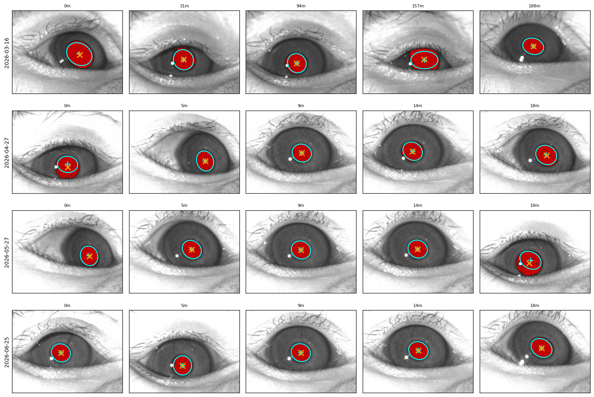
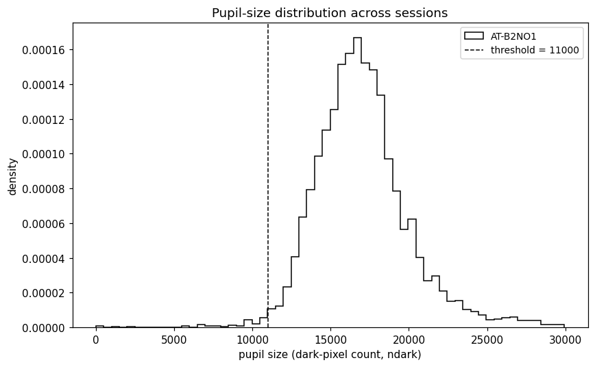
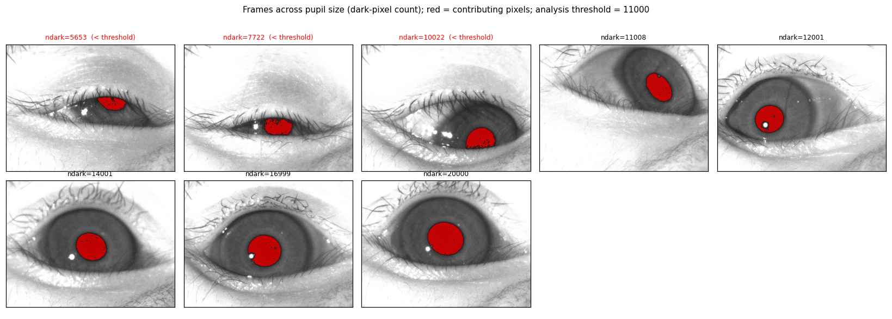
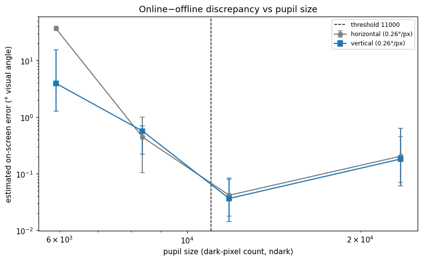
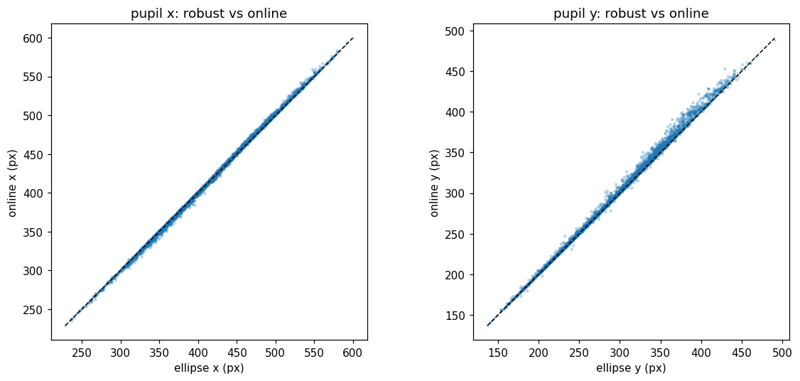
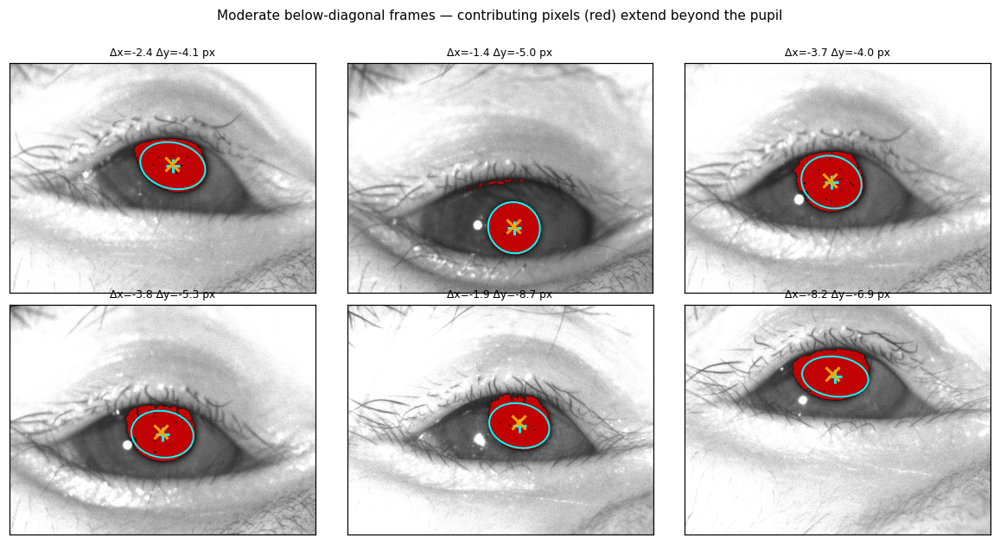
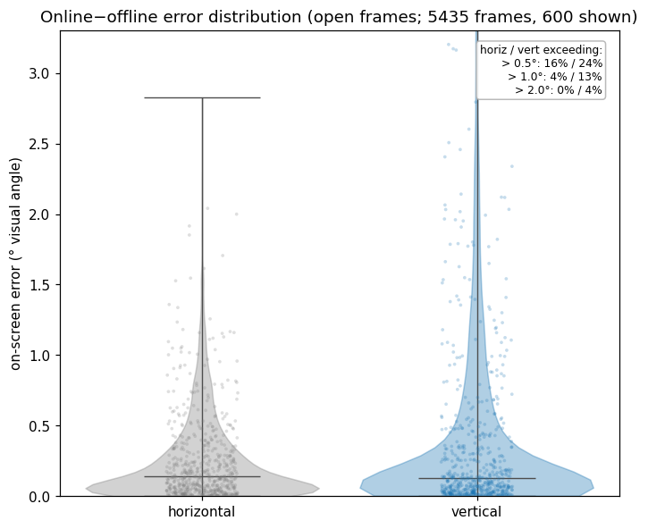

## Conclusion

With booth-appropriate thresholds, the online tracker is a faithful estimate of the offline pupil center on both animals — median disagreement < 1 px (≈ 0.15° of visual angle) and per-frame correlation ≈ 1.0. The main caveats are (i) a small tail of larger-error frames from peri-pupil dark pixels, and (ii) strong sensitivity to the `high` threshold (an over-high value produces large systematic errors), so the per-session manual threshold matters.

## Limitations

- 7 sessions per booth; one booth-2 session (2026-03-16) is low-yield (mostly closed) and contributes little.
- Openness thresholds are set manually per booth from the pupil-size histogram.
- On-screen degrees assume full-height gaze coverage (booth-1 width coverage ≈ 70%); exact conversion needs the calibration mapping.

## Reproduce

```python
# booth-specific high + openness are set inside make_report_accuracy.py per booth
python make_report_accuracy.py   # tracks 7+7 sessions at N=1000 (cached), writes results_accuracy.json + figures_acc/
```
