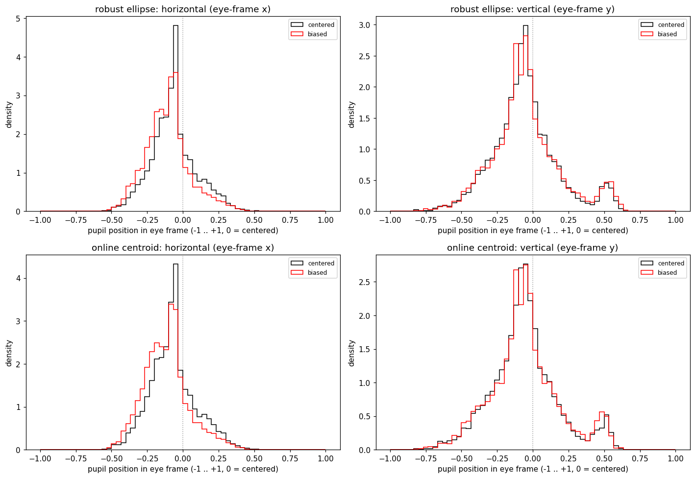
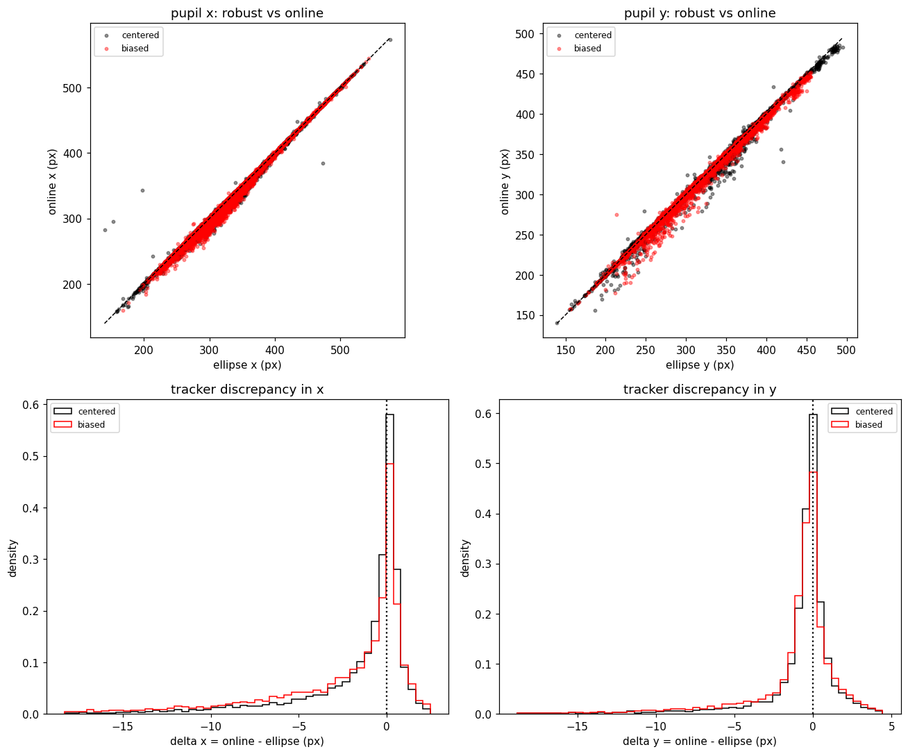

# Report 2 — Booth-1 gaze-bias investigation (N = 1000)

Generated by `make_report.py` from `results.json`. Animal `AT-B1NO1` (booth 1, high=50, open>5000). Companion to [`REPORT_accuracy.md`](REPORT_accuracy.md), which characterizes online-vs-offline tracking reliability across both booths.

## Question

Some booth-1 days look gaze-biased to one side in the enigma daily viewer, others centered. Is that a **real** day-to-day difference in where the animal looks, or an **artifact** of the online pupil tracker?

## Approach

Pupil position *in the raw image* isn't comparable across days: each session is a different crop/zoom of a fixed camera view, and the head-fixed animal may sit slightly differently. So we express the pupil in an **eye-anchored frame** built from landmarks clicked around the eye opening (`eye_frame`): `u` runs corner-to-corner (−1 .. +1, 0 = centered), `v` is vertical; invariant to crop/translation/zoom. We compare 7 **centered** vs 7 **biased** sessions (labeled from the daily viewer), summarizing each session by its mean `u`/`v` over open frames (`ndark > 5000`) and testing the two condition groups with a Welch t-test (session = unit). Both the offline (robust ellipse) and online (threshold-centroid) pupil estimates are carried through; if a real gaze shift exists it should appear in both. (Tracker accuracy itself — the two agree to <1 px — is quantified in Report 1.)

## Eye-anchored coordinate frame

Four example sessions: mean eye, clicked landmarks (yellow), axes from the origin (white dot) — `u` red, `v` green.


## Result — horizontal eye-frame position differs; vertical does not

Mean of the 7 per-session means, Welch t-test on those means (df ≈ 12):

| tracker | axis | centered | biased | t | p |
|---|---|---:|---:|---:|---:|
| robust | u (horizontal) | −0.068 | −0.107 | 3.05 | **0.011** |
| robust | v (vertical) | −0.056 | −0.047 | −0.46 | 0.657 |
| online | u (horizontal) | −0.074 | −0.116 | 2.94 | **0.013** |
| online | v (vertical) | −0.061 | −0.055 | −0.32 | 0.757 |

Biased days sit ~0.04 more negative in `u` (toward one corner), consistently in **both** trackers; the effect is horizontal only (Cohen's d ≈ 1.6). Using all detected frames (no openness filter) gives the same result (robust u p = 0.012, online u p = 0.014). Histograms (black = centered, red = biased; dotted line = eye center):



## The shift is not a tracker artifact

Two checks that the horizontal shift is not something specific to the online tracker:

- **Both trackers show it** (table above), and per-frame they agree closely (online–offline `x` correlation r = 0.997; full accuracy in Report 1).
- **The online−offline discrepancy does not differ between conditions**: per-session median Δx = −0.7 px (centered) vs −1.4 px (biased), Δy −0.25 vs −0.35 px (Welch p ≈ 0.36 / 0.42). So the small tracker bias is the same in both groups and cannot generate the ~0.04 (`u`) difference.



## The signal is in the eye frame, not raw image position

Per-session mean pupil `x` (open frames), compared two ways:

| measure | biased − centered | Welch p |
|---|---:|---:|
| raw image x / frame-width | −0.010 | 0.512 |
| eye-frame `u` (robust) | −0.039 | 0.011 |

The between-condition difference appears once the pupil is referenced to the eye, not in raw normalized image x (which is confounded by per-session crop/resolution).

## Per-session eye-frame position (mean over open frames)

`rob` = robust, `onl` = online.

| condition | date | u_rob | v_rob | u_onl | v_onl | n |
|---|---|---:|---:|---:|---:|---:|
| centered | 2026-05-27 | −0.047 | −0.032 | −0.046 | −0.037 | 976 |
| centered | 2026-04-30 | −0.098 | −0.060 | −0.100 | −0.066 | 963 |
| centered | 2026-06-11 | −0.079 | −0.127 | −0.082 | −0.130 | 959 |
| centered | 2026-06-09 | −0.068 | +0.012 | −0.072 | +0.012 | 961 |
| centered | 2026-03-02 | −0.089 | −0.090 | −0.103 | −0.091 | 634 |
| centered | 2026-02-04 | −0.053 | −0.059 | −0.064 | −0.078 | 957 |
| centered | 2026-02-13 | −0.044 | −0.035 | −0.048 | −0.040 | 972 |
| biased | 2026-06-04 | −0.083 | −0.068 | −0.090 | −0.077 | 964 |
| biased | 2026-05-20 | −0.117 | −0.069 | −0.117 | −0.076 | 940 |
| biased | 2026-05-12 | −0.070 | −0.081 | −0.072 | −0.087 | 973 |
| biased | 2026-04-17 | −0.146 | −0.027 | −0.157 | −0.039 | 935 |
| biased | 2026-03-19 | −0.100 | −0.015 | −0.118 | −0.021 | 924 |
| biased | 2026-04-13 | −0.102 | −0.053 | −0.108 | −0.058 | 977 |
| biased | 2026-04-07 | −0.132 | −0.015 | −0.151 | −0.027 | 961 |

## Conclusion

On biased days the pupil sits ~0.04 further toward one corner **within the eye** than on centered days (robust p = 0.011, online p = 0.013); vertical position is unchanged. The shift is present in both trackers, survives the openness filter, and is not explained by the (condition-independent) online−offline discrepancy or by raw image position. It therefore reflects a **real day-to-day difference in horizontal pupil position within the eye**, not an online-tracking artifact. Provided calibration is accurate, the estimated monitor-gaze coordinates reflect this real difference.

## Limitations

- Session as unit: n = 7 per condition (p = 0.011, d ≈ 1.6); the vertical null is not proof of no effect at this n.
- `u`/`v` depend on landmark placement consistency (verify with `show_landmarks(date)`).
- The eye frame removes crop/translation/zoom but not out-of-plane head reorientation relative to the camera; that residual (and whether calibration is per-session) is the remaining caveat for the on-screen estimate.

## Reproduce

```python
import eyevideo as ev
ev.ANIMAL_DIR = "/mnt/at-storageB1_I/EyeVideo/AT-B1NO1"; ev.OPEN_MIN = 5000
# python make_report.py   # high=50, needs eye_landmarks.json; writes results.json + figures_gaze_bias/
```
